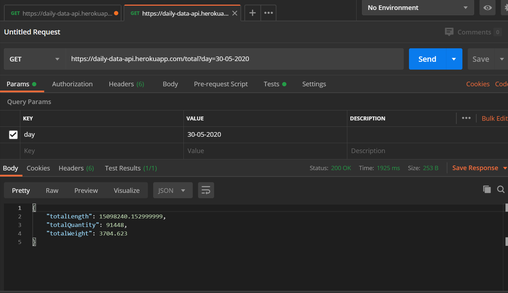
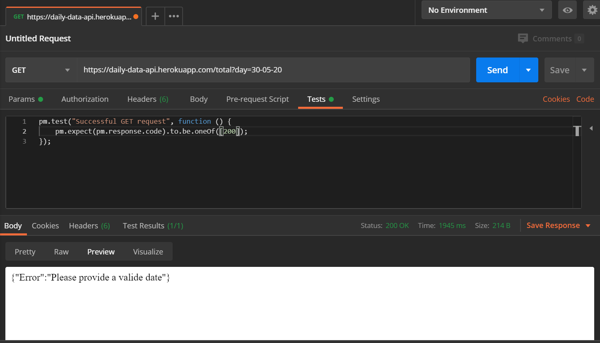

# Daily Data API
>API using a python's micro web framework called Flask. The API will be having three end-pints. The primary function of the API is to serve data on request.

API URL : https://daily-data-api.herokuapp.com
## Tasks
The API must accomplish the following prime tasks.
 - API with query string to be created, where day is the querystring.
For that particular day, sum all the Length, Weight, Quantity, it should
return an JSON
 - Create an excel file using the API provided,
It should segregate day wise data in different sheet in a single excel file.
Each Should have Column Name as DateTime, Length, Weight, Quantity.
This excel sheet should be returned when this API is queried.
## Run project
Follow the steps below to run the project on your local dev environment.
```sh
    $ git clone https://github.com/gowthamaraj/daily-data-API.git
    $ cd daily-data-API
    $ pip install -r requirements.txt
    $ python app.py
```
## API endpoints
These endpoints allow you to get data based on your request parameters from the source.

### GET
 - {baseURL}`/`
 - {baseURL}`/total?day=<date>`
 - {baseURL}`/excelreport`
 
#### GET /
**Parameters**
|Name|Required|Type|Description|
|----------:|:--------:|:-------:|---------- |
|`None` | - | -  | -|

**Response**

[
{"DateTime":"2020-06-01T10:00:00Z","Length":0.0,"Quantity":1746,"Weight":0.0},{"DateTime":"2020-06-01T09:00:00Z","Length":0.0,"Quantity":4063,"Weight":0.0}
...]

#### GET /total

**Parameters**

|Name|Required|Type|Description|
|----------:|:--------:|:-------:|---------- |
|`day` | required | String  | day= `(date)` , data must be in the format of `day:month:year(dd-mm-yyyy)`. for example, __31-05-2020__|
 
**Response**

{
    "totalLength": 15098240.152999999,
    "totalQuantity": 91448,
    "totalWeight": 3704.623
}

#### GET /excelreport

**Parameters**

|Name|Required|Type|Description|
|----------:|:--------:|:-------:|---------- |
|`None` | - | -  | -|

**Response**


## Interactions
### Postman 




